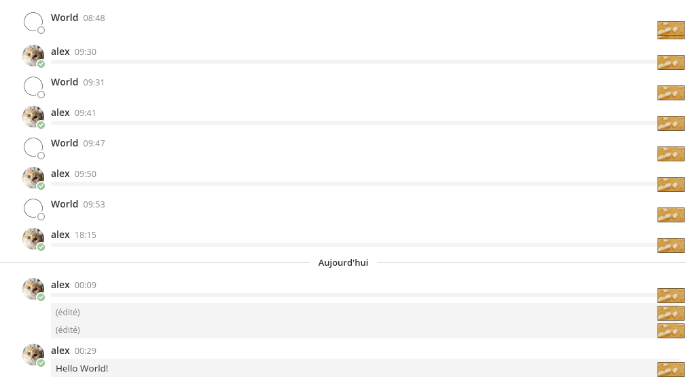

# matsmy
Overwhelm mattermost message of emoji :boom::blush:



## Installation
https://developer.mozilla.org/en-US/docs/Mozilla/Add-ons/WebExtensions/Your_first_WebExtension#Trying_it_out

## Dev environment
Run extension on your Firefox
```bash
npm install
npm start
```

## How to
Click on  button close to the target message.  


## Warning
**Use at your own risk, none of the contributors, in any way whatsoever, can be responsible for your use of the code contained in or linked from this repository.**
